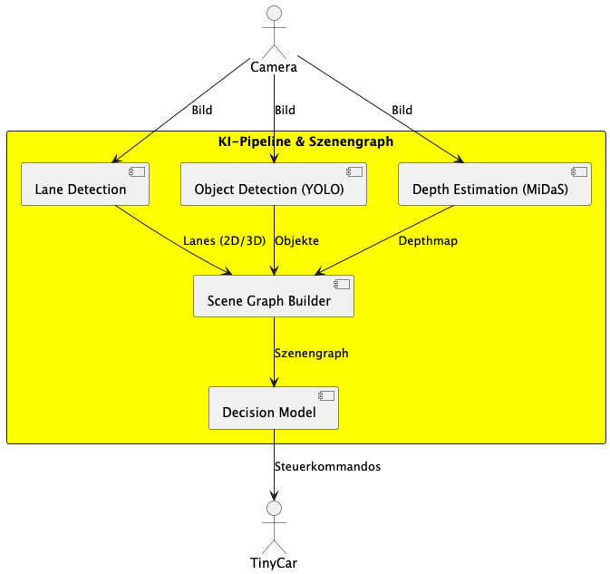
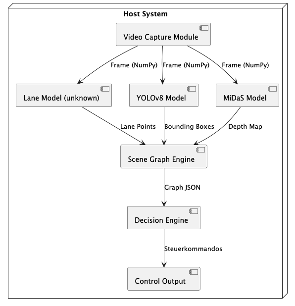

# 

**Über arc42**

arc42, das Template zur Dokumentation von Software- und
Systemarchitekturen.

Template Version 9.0-DE. (basiert auf der AsciiDoc Version), Juli 2025

Created, maintained and © by Dr. Peter Hruschka, Dr. Gernot Starke and
contributors. Siehe <https://arc42.org>.

# Einführung und Ziele
Dieses Projekt entwickelt eine Software, die ein Tiny-Car autonom steuern kann, indem es die Umgebung mithilfe mehrerer KI-Modelle aus Kamerabildern interpretiert.
Ziel ist es, aus dem Kamerafeed ein konsistentes 3D-Szenenmodell (Scene Graph) aufzubauen, das die Umgebung und die Beziehungen darin darstellt. Auf Grundlage dieses Szenengraphen trifft ein Decision-Modell (regelbasiert, heuristisch oder ML-basiert) Fahrentscheidungen und erzeugt konkrete Steuerkommandos für das Fahrzeug.

 ### Der Schwerpunkt liegt auf:

* Verknüpfung mehrerer KI-Modelle: Lane Detection, Object Detection (YOLO), Depth Estimation (MiDaS).

* Transformation der KI-Ausgaben in eine strukturierte, maschineninterpretierbare Repräsentation (Scene Graph).

* Echtzeitfähiger, modularer Softwarearchitektur, um verschiedene Hardwareplattformen oder Fahrzeuge bedienen zu können.

* Sauberer Schnittstellendefinition, sodass einzelne Komponenten austauschbar bleiben.

* Die Software bildet die Grundlage für ein erweiterbares System, das später für größere autonome Systeme, Robotik oder Simulationen genutzt werden kann.

## Aufgabenstellung
Die Kernaufgabe besteht darin:
1. Kamerabilder in Echtzeit einzulesen

2. Sie durch drei KI-Modelle zu verarbeiten:

    * Lane Detection → Fahrspuren
    * Object Detection (YOLO) → Objekte & Klassen
    * Depth Estimation (MiDaS) → Tiefeninformation (Entfernung)

    Aus diesen Informationen einen Scene Graph zu erzeugen, der z. B.:
    
    * Lane-Nodes
    * Objekt-Nodes 
    * Relationen: Abstand, Position relativ zur Spur, Kollisionsrisiko etc

3. Ein Decision-Modell anzuwenden, das basierend auf dem Graphen Fahrentscheidungen trifft (z. B. stoppen, beschleunigen, links/rechts korrigieren).

4. Steuerkommandos für das Tiny-Car auszugeben (z. B. via UART, API oder GPIO).

Der Fokus liegt nicht nur auf der KI, sondern auf der Integration aller Bausteine in ein vollständig lauffähiges System.
## Qualitätsziele

| Qualitätsziel          | Beschreibung                                                                                   |
| ---------------------- | ---------------------------------------------------------------------------------------------- |
| **Echtzeitfähigkeit**  | Verarbeitung min. 10–20 FPS, damit das Fahrzeug sinnvoll reagieren kann.                       |
| **Modularität**        | Alle Komponenten (KI-Modelle, Graph, Decision Logic, IO) müssen austauschbar sein.             |
| **Portabilität**       | System soll auf Windows, Linux und später auf Embedded-Hardware (Raspberry Pi, Jetson) laufen. |
| **Robustheit**         | System muss Ausreißer der KI-Modelle kompensieren (z. B. fehlende Lane Detection).             |
| **Erweiterbarkeit**    | Leicht neue Sensoren oder Modelle integrierbar.                                                |
| **Gute Dokumentation** | Da es ein Uni-Projekt ist, steht Nachvollziehbarkeit im Vordergrund.                           |
| **Testbarkeit**        | Jede Komponente isoliert testbar (Unit Tests + Replay von Kameradaten).                        |

## Stakeholder

| Stakeholder                | Interesse                                                                                   |
| -------------------------- | -------------------------------------------------------------------------------------------- |
| **Software-Entwickler*innen** | Gut dokumentierte Architektur, gut kapselte Module.                                         |
| **Projektbetreuer/Professoren** | Verifizierbare, reproduzierbare Ergebnisse; saubere Architektur.                           |
| **Nutzer (Maker/Studierende)** | Einfache Erweiterung für eigene autonome Mini-Fahrzeuge.                                   |
| **Zukünftiges Ich**       | Verständliche Codebasis, die später weiterverwendet und erweitert werden kann.               |

# Randbedingungen
* Projekt muss innerhalb eines Semesters umsetzbar sein.

* Muss auf Python basieren (wegen KI-Modelle & Prototyping).

* Hardware: Tiny-Car + Kamera, optional Raspberry Pi oder Laptop als Recheneinheit.

* Kein kommerzielles Framework; alles in Open-Source realisierbar.

* Echtzeitfähigkeit (im Rahmen von Python) notwendig.

* Nur ein Kamerasensor (Monocular Vision).

# Kontextabgrenzung 
Systemgrenze:
Das System sitzt zwischen Kamera und Fahrzeugsteuerung.

## Fachlicher Kontext 
 

## Technischer Kontext 

# Lösungsstrategie {#section-solution-strategy}

# Bausteinsicht {#section-building-block-view}

## Whitebox Gesamtsystem {#_whitebox_gesamtsystem}

***\<Übersichtsdiagramm\>***

Begründung

:   *\<Erläuternder Text\>*

Enthaltene Bausteine

:   *\<Beschreibung der enthaltenen Bausteine (Blackboxen)\>*

Wichtige Schnittstellen

:   *\<Beschreibung wichtiger Schnittstellen\>*

### \<Name Blackbox 1\> {#_name_blackbox_1}

*\<Zweck/Verantwortung\>*

*\<Schnittstelle(n)\>*

*\<(Optional) Qualitäts-/Leistungsmerkmale\>*

*\<(Optional) Ablageort/Datei(en)\>*

*\<(Optional) Erfüllte Anforderungen\>*

*\<(optional) Offene Punkte/Probleme/Risiken\>*

### \<Name Blackbox 2\> {#_name_blackbox_2}

*\<Blackbox-Template\>*

### \<Name Blackbox n\> {#_name_blackbox_n}

*\<Blackbox-Template\>*

### \<Name Schnittstelle 1\> {#_name_schnittstelle_1}

...​

### \<Name Schnittstelle m\> {#_name_schnittstelle_m}

## Ebene 2 {#_ebene_2}

### Whitebox *\<Baustein 1\>* {#_whitebox_baustein_1}

*\<Whitebox-Template\>*

### Whitebox *\<Baustein 2\>* {#_whitebox_baustein_2}

*\<Whitebox-Template\>*

...​

### Whitebox *\<Baustein m\>* {#_whitebox_baustein_m}

*\<Whitebox-Template\>*

## Ebene 3 {#_ebene_3}

### Whitebox \<\_Baustein x.1\_\> {#_whitebox_baustein_x_1}

*\<Whitebox-Template\>*

### Whitebox \<\_Baustein x.2\_\> {#_whitebox_baustein_x_2}

*\<Whitebox-Template\>*

### Whitebox \<\_Baustein y.1\_\> {#_whitebox_baustein_y_1}

*\<Whitebox-Template\>*

# Laufzeitsicht {#section-runtime-view}

## *\<Bezeichnung Laufzeitszenario 1\>* {#_bezeichnung_laufzeitszenario_1}

- \<hier Laufzeitdiagramm oder Ablaufbeschreibung einfügen\>

- \<hier Besonderheiten bei dem Zusammenspiel der Bausteine in diesem
  Szenario erläutern\>

## *\<Bezeichnung Laufzeitszenario 2\>* {#_bezeichnung_laufzeitszenario_2}

...​

## *\<Bezeichnung Laufzeitszenario n\>* {#_bezeichnung_laufzeitszenario_n}

...​

# Verteilungssicht {#section-deployment-view}

## Infrastruktur Ebene 1 {#_infrastruktur_ebene_1}

***\<Übersichtsdiagramm\>***

Begründung

:   *\<Erläuternder Text\>*

Qualitäts- und/oder Leistungsmerkmale

:   *\<Erläuternder Text\>*

Zuordnung von Bausteinen zu Infrastruktur

:   *\<Beschreibung der Zuordnung\>*

## Infrastruktur Ebene 2 {#_infrastruktur_ebene_2}

### *\<Infrastrukturelement 1\>* {#_infrastrukturelement_1}

*\<Diagramm + Erläuterungen\>*

### *\<Infrastrukturelement 2\>* {#_infrastrukturelement_2}

*\<Diagramm + Erläuterungen\>*

...​

### *\<Infrastrukturelement n\>* {#_infrastrukturelement_n}

*\<Diagramm + Erläuterungen\>*

# Querschnittliche Konzepte {#section-concepts}

## *\<Konzept 1\>* {#_konzept_1}

*\<Erklärung\>*

## *\<Konzept 2\>* {#_konzept_2}

*\<Erklärung\>*

...​

## *\<Konzept n\>* {#_konzept_n}

*\<Erklärung\>*

# Architekturentscheidungen {#section-design-decisions}

# Qualitätsanforderungen {#section-quality-scenarios}

## Übersicht der Qualitätsanforderungen {#_übersicht_der_qualitätsanforderungen}

## Qualitätsszenarien {#_qualitätsszenarien}

# Risiken und technische Schulden {#section-technical-risks}

# Glossar {#section-glossary}

+----------------------+-----------------------------------------------+
| Begriff              | Definition                                    |
+======================+===============================================+
| *\<Begriff-1\>*      | *\<Definition-1\>*                            |
+----------------------+-----------------------------------------------+
| *\<Begriff-2*        | *\<Definition-2\>*                            |
+----------------------+-----------------------------------------------+
